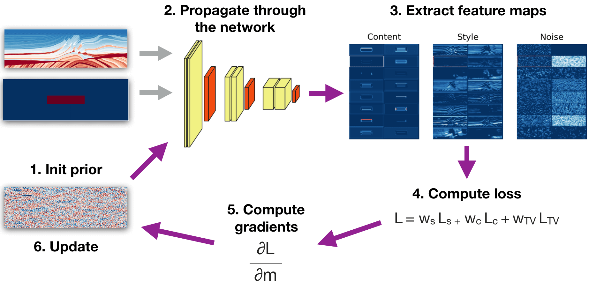
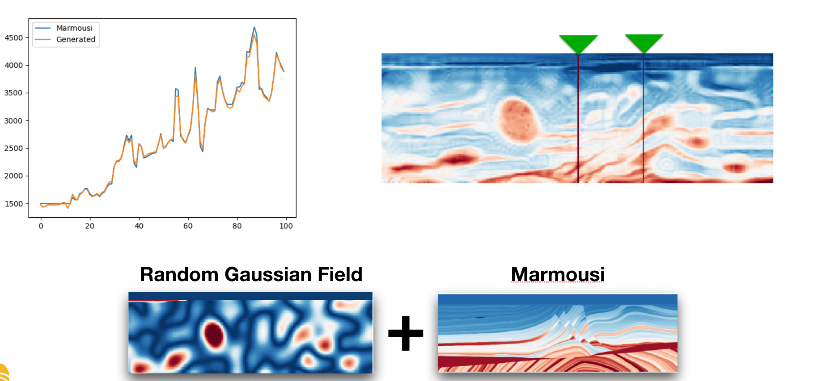

# Style transfer for generation of realistically textured subsurface models. Visualized and explained. 

*[Ovcharenko Oleg](https://ovcharenkoo.com/), [Vladimir Kazei](https://github.com/vkazei), [Daniel Peter](https://github.com/danielpeter), and [Tariq Alkhalifah](https://sites.google.com/a/kaust.edu.sa/tariq/home). ["Style transfer for generation of realistically textured subsurface models."](https://library.seg.org/doi/abs/10.1190/segam2019-3216349.1) In SEG Technical Program Expanded Abstracts 2019, pp. 2393-2397. Society of Exploration Geophysicists, 2019.*

The notebook in this repository reproduces the workflow for **texture-transfer from an elastic isotropic subsurface model to a prior synthetic distribution**. We follow the [(Gatys et al., 2015)](https://arxiv.org/abs/1508.06576) to transfer texture from a [Marmousi II](https://library.seg.org/doi/full/10.1190/1.2172306) benchmark geological model to a background distribution generated using a random Gaussian field.

## Example

Make a random Gaussian field resamble the Marmousi II layered features.

## Workfolw
We apply the iterative optimization approach which benefits from higher control at cost of longer generation times. To accelerate the texture transfer one would use a GAN-based approach as proposed by [(Johnson et al., 2016)](https://link.springer.com/chapter/10.1007/978-3-319-46475-6_43) and [(Ulyanov et al., 2016)](http://proceedings.mlr.press/v48/ulyanov16.pdf).

## Visualizations
Seeing the outputs from intermediate layers in the network leads to better understaing of what is going on at each step of the algorithm.

## Well-log constrains 
Enforcing the optimization to match certain areas from the style model ultimately leads to a controlled texture generation.

## How to run
In the terminal, go to the folder with the notebook and run the command

    jupyter notebook geo_style.ipynb

## Resources used:

https://github.com/kevinzakka/style-transfer

https://github.com/rrmina/neural-style-pytorch

https://www.tensorflow.org/beta/tutorials/generative/style_transfer

### Dependencies
Jupyter&nbsp;&nbsp;&nbsp;&nbsp;4.4.0

Keras&nbsp;&nbsp;&nbsp;&nbsp;2.2.4

Numpy&nbsp;&nbsp;&nbsp;&nbsp;1.15.4

Pillow&nbsp;&nbsp;&nbsp;&nbsp;5.3.0

Scipy&nbsp;&nbsp;&nbsp;&nbsp;1.1.0

### BibTeX
    @incollection{ovcharenko2019style,
    title={Style transfer for generation of realistically textured subsurface models},
    author={Ovcharenko, Oleg and Kazei, Vladimir and Peter, Daniel and Alkhalifah, Tariq},
    booktitle={SEG Technical Program Expanded Abstracts 2019},
    pages={2393--2397},
    year={2019},
    publisher={Society of Exploration Geophysicists}
    }
